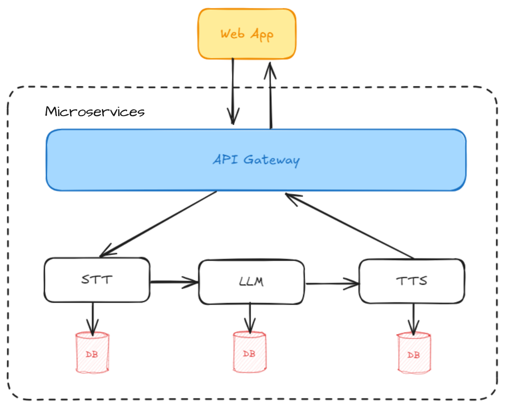
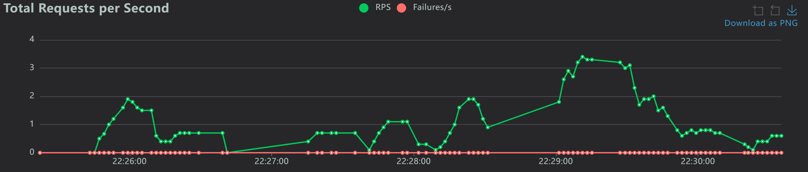
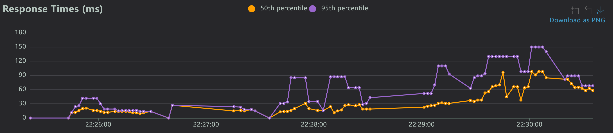
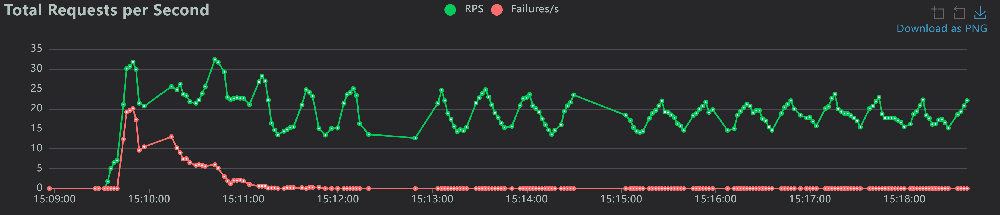
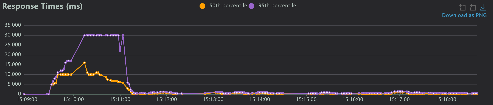
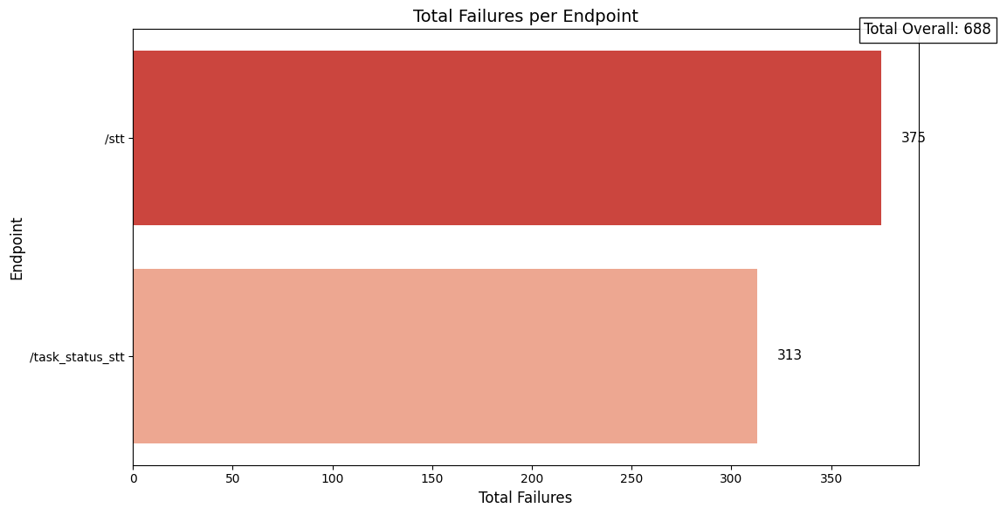

# The Efficiency of Microservices Architecture for AI Applications

A comprehensive microservices-based platform that demonstrates the efficiency of microservices architecture for AI applications, providing Speech-to-Text (STT), Large Language Model (LLM), and Text-to-Speech (TTS) capabilities. The application is fully containerized using Docker and includes monitoring, load balancing, and performance testing to demonstrate architectural efficiency.

> **Note**: While the main goal is to evaluate the efficiency of microservices architecture for AI applications, a user-friendly Streamlit frontend has been built to allow people to interact with the application and experience the complete AI workflow in real-time.

## 🎯 **AI Models Used**

### **Speech-to-Text (STT)**: OpenAI Whisper
- **Model**: Whisper Base
- **Capabilities**: Automatic speech recognition with high accuracy
- **Features**: Multilingual support, noise robustness, real-time transcription
- **Use Case**: Converts audio input to text for further processing

### **Large Language Model (LLM)**: Qwen 2.5 72B Instruct
- **Model**: Qwen/Qwen2.5-72B-Instruct
- **Capabilities**: Advanced reasoning, multilingual understanding, instruction following
- **Features**: 72B parameters, optimized for instruction-following tasks
- **Use Case**: Processes transcribed text and generates intelligent responses

### **Text-to-Speech (TTS)**: Google Text-to-Speech (gTTS)
- **Model**: Google's Text-to-Speech API
- **Capabilities**: Natural-sounding speech synthesis
- **Features**: Multilingual support, customizable voice parameters
- **Use Case**: Converts LLM responses back to audio for user interaction

## 🏗️ Architecture Overview

The platform consists of the following microservices:

- **STT Service**: Converts audio files to text using OpenAI Whisper
- **LLM Service**: Processes text queries using Qwen2-72B-Instruct model
- **TTS Service**: Converts text to speech using Google Text-to-Speech (gTTS)
- **Frontend**: Streamlit-based web interface for user interaction
- **API Gateway**: Traefik for load balancing and routing
- **Message Queue**: Redis for task queuing and Celery for asynchronous processing
- **Databases**: PostgreSQL for STT/TTS data, MongoDB for LLM data
- **Monitoring**: Prometheus and Grafana for observability
- **Load Testing**: Locust for performance testing

## 🚀 Quick Start

### Installation

1. **Clone the repository:**
   ```bash
   git clone https://github.com/lizmarques/ai-microservices-application.git
   ```

2. **Start the application:**
   ```bash
   docker-compose up -d
   ```

3. **Verify all services are running:**
   ```bash
   docker-compose ps
   ```
4. **Rebuild specific services:**
   ```bash
   # Rebuild STT service
   docker-compose build stt
   
   # Rebuild all services
   docker-compose build
   
   # Rebuild and restart
   docker-compose up --build
   ```
5. **Access the application:**
   - **Main Application (Streamlit Frontend)**: http://localhost:443
   - **Traefik Dashboard**: http://localhost:8080
   - **Grafana Monitoring**: http://localhost:3000
   - **Prometheus Metrics**: http://localhost:9090
   - **PgAdmin**: http://localhost:5050

## 📋 Service Details

### Core Services

| Service | Port | Description | Database |
|---------|------|-------------|----------|
| STT API | 8502 | Speech-to-Text processing | PostgreSQL (stt_service) |
| LLM API | 8503 | Language model processing | MongoDB (llm_service) |
| TTS API | 8504 | Text-to-Speech generation | PostgreSQL (tts_service) |
| Frontend | 8505 | Streamlit web interface | - |
| Traefik | 80/443 | API Gateway & Load Balancer | - |

### Infrastructure Services

| Service | Port | Description |
|---------|------|-------------|
| Redis | 6379 | Message broker for Celery |
| PostgreSQL STT | 5433 | Database for STT data |
| PostgreSQL TTS | 5434 | Database for TTS data |
| MongoDB | 27017 | Database for LLM data |
| PgAdmin | 5050 | PostgreSQL administration |
| Prometheus | 9090 | Metrics collection |
| Grafana | 3000 | Monitoring dashboard |

## 🔧 Configuration

### Environment Variables

The application uses environment variables for configuration. Key variables include:

- `POSTGRES_DB`: Database name
- `POSTGRES_USER`: Database username
- `POSTGRES_PASSWORD`: Database password
- `POSTGRES_HOST`: Database host
- `MONGO_HOST`: MongoDB host
- `CELERY_BROKER_URL`: Redis broker URL

### Database Configuration

- **STT Service**: Uses PostgreSQL with `stt_transcriptions` table
- **TTS Service**: Uses PostgreSQL with `tts_results` table  
- **LLM Service**: Uses MongoDB with `llm_queries` collection

## 🧪 Testing & Performance

### Load Testing with Locust

The application includes comprehensive load testing capabilities:

1. **Start load testing:**
   ```bash
   docker-compose up locust
   ```

2. **Access Locust UI:**
   - Navigate to http://localhost:8089
   - Configure test parameters (users, spawn rate, duration)
   - Run performance tests

3. **Test Scenarios:**
   - **Scenario 1**: Light load (10 users, 1 user/second, 5 minutes)
   - **Scenario 2**: Heavy load (50+ users, stress testing)

## 📊 API Endpoints

### STT Service
- `POST /stt` - Upload audio file for transcription
- `GET /task_status_stt/{task_id}` - Check transcription status
- `GET /metrics` - Prometheus metrics

### LLM Service
- `POST /llm` - Send text for LLM processing
- `GET /task_status_llm/{task_id}` - Check LLM processing status
- `GET /metrics` - Prometheus metrics

### TTS Service
- `POST /tts` - Send text for speech generation
- `GET /task_status_tts/{task_id}` - Check TTS generation status
- `GET /get_audio/{filename}` - Download generated audio file
- `GET /metrics` - Prometheus metrics

## 🔄 **Complete AI Workflow**

The application demonstrates a complete AI conversation pipeline:

1. **🎤 Audio Input**: User records audio via the Streamlit frontend interface
2. **📝 STT Processing**: Audio is sent to the STT service (Whisper) for transcription
3. **🧠 LLM Processing**: Transcribed text is processed by the LLM service (Qwen 2.5 72B)
4. **🔊 TTS Generation**: LLM response is converted to speech using gTTS
5. **🎵 Audio Output**: Generated audio is automatically played back to the user

### **User Experience**
- **Interactive Interface**: Clean, intuitive Streamlit web application
- **Real-time Processing**: Asynchronous task processing with status updates
- **Seamless Integration**: Complete AI conversation in a single workflow
- **Performance Monitoring**: Built-in metrics and monitoring for efficiency analysis

## 🛠️ Development

### Project Structure

```
├── services/                 # Microservices APIs
│   ├── stt_api.py          # Speech-to-Text service (Whisper)
│   ├── llm_api.py          # Language model service (Qwen 2.5 72B)
│   ├── tts_api.py          # Text-to-Speech service (gTTS)
│   ├── celery_worker.py    # Celery worker configuration
│   ├── requirements_stt.txt # STT service dependencies
│   ├── requirements_llm.txt # LLM service dependencies
│   ├── requirements_tts.txt # TTS service dependencies
│   └── requirements_worker.txt # Worker dependencies
├── frontend/               # Streamlit web interface
│   ├── streamlit_app.py   # Main Streamlit application
│   ├── Dockerfile         # Frontend container configuration
│   └── requirements_streamlit.txt # Frontend dependencies
├── Docker/                 # Docker configurations
│   ├── Dockerfile-stt     # STT service container
│   ├── Dockerfile-llm     # LLM service container
│   ├── Dockerfile-tts     # TTS service container
│   └── Dockerfile-worker  # Worker service container
├── locust/                # Load testing
│   ├── locustfile.py      # Locust test scenarios
│   ├── Dockerfile-locust  # Locust container
│   └── requirements_locust.txt # Locust dependencies
├── monitoring/             # Monitoring configuration
│   └── prometheus.yml
├── traefik/               # API Gateway configuration
│   └── traefik.yml
├── shared/                # Shared utilities
│   └── celery_config.py
├── docker-compose.yml     # Main orchestration
└── README.md             # This documentation
```

## 🎯 **Research Focus**

This project serves as a comprehensive study of microservices architecture efficiency for AI applications, featuring:

- **Architectural Analysis**: Performance comparison between monolithic vs. microservices approaches
- **Load Testing**: Comprehensive testing scenarios using Locust for performance evaluation
- **Monitoring & Metrics**: Real-time monitoring with Prometheus and Grafana
- **Scalability Studies**: Analysis of service scaling and resource utilization
- **Efficiency Metrics**: Detailed performance measurements and optimization insights

## 🧪 Experimental Methodology & Results

This research follows an **exploratory and quantitative experimental design**, evaluating the **efficiency and scalability** of a real-time AI application based on a **microservices architecture**.  
The system enables human–machine interaction through live speech, leveraging three core services:

- **STT (Speech-to-Text)** – transcribes the user’s audio input  
- **LLM (Large Language Model)** – generates textual responses  
- **TTS (Text-to-Speech)** – converts text back into synthesized speech  

Each service runs independently and communicates through REST APIs managed by an **API Gateway** (Traefik). Every microservice has its own database—**PostgreSQL** for structured data and **MongoDB** for LLM responses—following the *database-per-service* pattern to ensure autonomy and isolation.  
All services are containerized via **Docker Compose**, allowing horizontal and vertical scalability.

### 🧩 Architecture Overview
<p align="center">
  <br>
  <em>Figure 1 – Microservices Architecture of the Application</em>
</p>

---

### ⚙️ Experimental Setup

Performance tests were executed with **Locust**, simulating real-time requests to measure:
- Total pipeline latency (STT → LLM → TTS)  
- Individual service latency  
- Throughput (Requests per Second – RPS)  
- Error rate and stability under load  

Two controlled scenarios were evaluated using the same input prompt in portuguese, **“Quem fundou a Apple? (Who founded Apple?)”**, to ensure consistency.

---

## 📈 Performance Results

### **Scenario 1 – Low Load (10 Concurrent Users)**

This baseline test evaluated latency and overhead under light traffic.  
The system processed requests smoothly, maintaining an average total latency **below 1.5 seconds** with **no failed requests**.  
The API Gateway introduced minimal overhead (<100ms), and REST communication proved efficient.

<p align="center">
  <br>
  <em>Figure 2 – Total Requests per Second (Low Load)</em>
</p>

<br><br>

<p align="center">
  <br>
  <em>Figure 3 – Response Times (Low Load)</em>
</p>


✅ **Key Findings**  
- Consistent latency and stability across all services  
- No observed bottlenecks  
- REST-based communication and API Gateway overhead negligible  

---

### **Scenario 2 – High Load (500 Concurrent Users)**

The stress test simulated high concurrency to evaluate scalability and fault tolerance.  
Throughput peaked at **~30 requests per second**, stabilizing after approximately 3 minutes.  
However, **STT** emerged as the main bottleneck due to higher computational demands, resulting in increased latency and temporary saturation.

<p align="center">
  <br>
  <em>Figure 4 – Total Requests per Second (High Load)</em>
</p>

<br><br>

<p align="center">
  <br>
  <em>Figure 5 – Response Times (High Load)</em>
</p>

<br><br>

<p align="center">
  <br>
  <em>Figure 6 – Total Failures per Endpoint (High Load)</em>
</p>

✅ **Key Findings**  
- The **STT** service reached latency peaks (~10s) during initial load spikes, confirming it as the main computational bottleneck  
- The **LLM** and **TTS** services maintained stable performance  
- The **API Gateway** added slight latency overhead under heavy load but remained operational  
- The system sustained **~30 RPS** after stabilization, validating the architecture’s scalability potential  

---

### 📊 Summary

| Metric | Scenario 1 (Low Load) | Scenario 2 (High Load) |
|:--|:--:|:--:|
| Average Pipeline Latency | < 1.5 s | 3–4 s (after stabilization) |
| API Gateway Overhead | < 100 ms | < 250 ms |
| Throughput | 1–3 RPS | ~30 RPS |
| Success Rate | 100% | 95–97% (temporary errors during spikes) |
| Main Bottleneck | None | STT service |

---

### 🧠 Interpretation

- The **modular microservices architecture** proved efficient and resilient under both light and heavy load conditions.  
- **Independent databases and containerization** contributed to isolation and recoverability.  
- **STT performance** directly influenced total pipeline latency, suggesting optimization or asynchronous queuing strategies (e.g., Celery) could further enhance scalability.  
